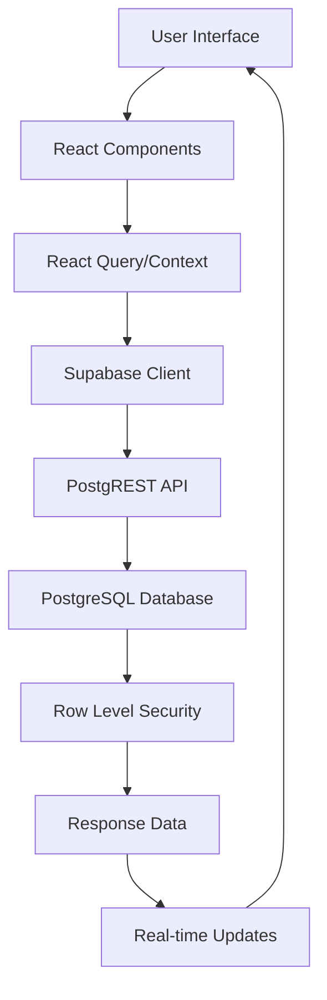
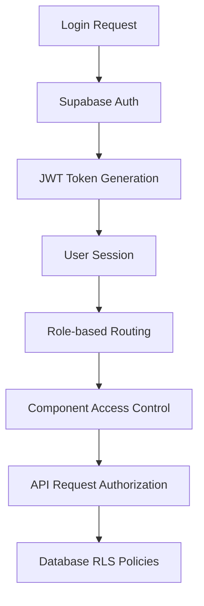

# MMU LMS - Technical Architecture Documentation

## 🏗️ **System Architecture Overview**

The MMU Learning Management System is built using a modern, scalable architecture that prioritizes performance, security, and maintainability. The system follows a microservices-inspired approach with a React frontend and Supabase backend.

## 🎯 **Architecture Principles**

### **1. Separation of Concerns**
- **Frontend**: Pure presentation layer with React components
- **Backend**: Supabase handles data, authentication, and business logic
- **AI Services**: Dedicated AI processing through OpenAI integration
- **File Storage**: Secure file management with Supabase Storage

### **2. Scalability**
- **Horizontal Scaling**: Supabase automatically scales based on demand
- **Component-Based Architecture**: Reusable React components for maintainability
- **Lazy Loading**: Code splitting for optimal performance
- **CDN Integration**: Fast global content delivery

### **3. Security First**
- **Row Level Security (RLS)**: Database-level security policies
- **JWT Authentication**: Secure token-based authentication
- **Role-Based Access Control**: Granular permission system
- **API Security**: Rate limiting and request validation

## 🔧 **Technology Stack**

### **Frontend Technologies**

#### **Core Framework**
```typescript
// React 18 with TypeScript
- React 18.2.0+ (Latest stable)
- TypeScript 5.0+ (Type safety)
- Vite 4.0+ (Build tool)
- React Router 6+ (Client-side routing)
```

#### **UI & Styling**
```typescript
// Modern UI Stack
- Tailwind CSS 3.3+ (Utility-first CSS)
- Shadcn/UI (Component library)
- Lucide React (Icon library)
- Framer Motion (Animations)
- React Hook Form (Form management)
```

#### **State Management**
```typescript
// State Management Solutions
- React Context API (Global state)
- React Query/TanStack Query (Server state)
- Zustand (Client state management)
- React Hook Form (Form state)
```

### **Backend Technologies**

#### **Backend-as-a-Service**
```sql
-- Supabase Stack
- PostgreSQL 15+ (Primary database)
- PostgREST (Auto-generated REST API)
- GoTrue (Authentication service)
- Realtime (WebSocket connections)
- Edge Functions (Serverless functions)
```

#### **Authentication & Security**
```typescript
// Security Implementation
- Supabase Auth (JWT-based authentication)
- Row Level Security (Database-level permissions)
- API Rate Limiting (Request throttling)
- CORS Configuration (Cross-origin security)
```

### **AI Integration**

#### **AI Services**
```typescript
// AI Implementation
- OpenAI GPT-4 (Primary AI model)
- Custom prompt engineering
- Context-aware responses
- Educational content generation
```

## 📊 **Database Schema**

### **Core Tables**

#### **User Management**
```sql
-- Users table (extends Supabase auth.users)
CREATE TABLE profiles (
  id UUID REFERENCES auth.users PRIMARY KEY,
  email TEXT UNIQUE NOT NULL,
  full_name TEXT,
  role user_role NOT NULL DEFAULT 'student',
  avatar_url TEXT,
  created_at TIMESTAMP WITH TIME ZONE DEFAULT NOW(),
  updated_at TIMESTAMP WITH TIME ZONE DEFAULT NOW()
);

-- User roles enum
CREATE TYPE user_role AS ENUM ('student', 'lecturer', 'dean', 'admin');
```

#### **Academic Structure**
```sql
-- Courses table
CREATE TABLE courses (
  id UUID PRIMARY KEY DEFAULT gen_random_uuid(),
  title TEXT NOT NULL,
  description TEXT,
  course_code TEXT UNIQUE NOT NULL,
  credits INTEGER DEFAULT 3,
  lecturer_id UUID REFERENCES profiles(id),
  created_at TIMESTAMP WITH TIME ZONE DEFAULT NOW()
);

-- Course enrollments
CREATE TABLE course_enrollments (
  id UUID PRIMARY KEY DEFAULT gen_random_uuid(),
  student_id UUID REFERENCES profiles(id),
  course_id UUID REFERENCES courses(id),
  enrolled_at TIMESTAMP WITH TIME ZONE DEFAULT NOW(),
  status enrollment_status DEFAULT 'active'
);
```

#### **Content Management**
```sql
-- Course materials
CREATE TABLE course_materials (
  id UUID PRIMARY KEY DEFAULT gen_random_uuid(),
  course_id UUID REFERENCES courses(id),
  title TEXT NOT NULL,
  description TEXT,
  file_url TEXT,
  material_type material_type NOT NULL,
  is_public BOOLEAN DEFAULT false,
  created_by UUID REFERENCES profiles(id),
  created_at TIMESTAMP WITH TIME ZONE DEFAULT NOW()
);

-- Assignments
CREATE TABLE assignments (
  id UUID PRIMARY KEY DEFAULT gen_random_uuid(),
  course_id UUID REFERENCES courses(id),
  title TEXT NOT NULL,
  description TEXT,
  due_date TIMESTAMP WITH TIME ZONE,
  max_points INTEGER DEFAULT 100,
  created_by UUID REFERENCES profiles(id),
  created_at TIMESTAMP WITH TIME ZONE DEFAULT NOW()
);
```

### **Row Level Security Policies**

#### **Student Data Protection**
```sql
-- Students can only see their own data
CREATE POLICY "Students can view own profile" ON profiles
  FOR SELECT USING (auth.uid() = id OR role = 'student');

-- Students can only see courses they're enrolled in
CREATE POLICY "Students see enrolled courses" ON courses
  FOR SELECT USING (
    id IN (
      SELECT course_id FROM course_enrollments 
      WHERE student_id = auth.uid()
    )
  );
```

#### **Lecturer Permissions**
```sql
-- Lecturers can manage their courses
CREATE POLICY "Lecturers manage own courses" ON courses
  FOR ALL USING (lecturer_id = auth.uid());

-- Lecturers can see enrolled students
CREATE POLICY "Lecturers see course students" ON profiles
  FOR SELECT USING (
    id IN (
      SELECT student_id FROM course_enrollments ce
      JOIN courses c ON ce.course_id = c.id
      WHERE c.lecturer_id = auth.uid()
    )
  );
```

## 🔄 **Data Flow Architecture**

### **Request Flow**


### **Authentication Flow**


## 🚀 **Performance Optimization**

### **Frontend Optimization**

#### **Code Splitting**
```typescript
// Lazy loading for route-based code splitting
const StudentDashboard = lazy(() => import('./pages/student/Dashboard'));
const LecturerDashboard = lazy(() => import('./pages/lecturer/Dashboard'));

// Component-level code splitting
const HeavyComponent = lazy(() => import('./components/HeavyComponent'));
```

#### **Caching Strategy**
```typescript
// React Query caching configuration
const queryClient = new QueryClient({
  defaultOptions: {
    queries: {
      staleTime: 5 * 60 * 1000, // 5 minutes
      cacheTime: 10 * 60 * 1000, // 10 minutes
      refetchOnWindowFocus: false,
    },
  },
});
```

### **Database Optimization**

#### **Indexing Strategy**
```sql
-- Performance indexes
CREATE INDEX idx_course_enrollments_student ON course_enrollments(student_id);
CREATE INDEX idx_course_enrollments_course ON course_enrollments(course_id);
CREATE INDEX idx_assignments_course ON assignments(course_id);
CREATE INDEX idx_materials_course ON course_materials(course_id);
```

#### **Query Optimization**
```sql
-- Optimized queries with proper joins
SELECT c.*, ce.enrolled_at
FROM courses c
JOIN course_enrollments ce ON c.id = ce.course_id
WHERE ce.student_id = $1 AND ce.status = 'active';
```

## 🔐 **Security Implementation**

### **Authentication Security**
```typescript
// JWT token validation
const validateToken = async (token: string) => {
  try {
    const { data, error } = await supabase.auth.getUser(token);
    if (error) throw error;
    return data.user;
  } catch (error) {
    throw new Error('Invalid token');
  }
};
```

### **API Security**
```typescript
// Rate limiting implementation
const rateLimiter = rateLimit({
  windowMs: 15 * 60 * 1000, // 15 minutes
  max: 100, // limit each IP to 100 requests per windowMs
  message: 'Too many requests from this IP',
});
```

### **Data Validation**
```typescript
// Input validation with Zod
const userSchema = z.object({
  email: z.string().email(),
  password: z.string().min(8),
  role: z.enum(['student', 'lecturer', 'dean', 'admin']),
});
```

## 📱 **Mobile Responsiveness**

### **Responsive Design Strategy**
```css
/* Mobile-first responsive design */
.container {
  @apply px-4 sm:px-6 lg:px-8;
  @apply max-w-sm sm:max-w-md md:max-w-lg lg:max-w-7xl;
}

/* Responsive grid layouts */
.grid-responsive {
  @apply grid grid-cols-1 md:grid-cols-2 lg:grid-cols-3 xl:grid-cols-4;
}
```

### **Progressive Web App Features**
```typescript
// Service worker for offline functionality
if ('serviceWorker' in navigator) {
  navigator.serviceWorker.register('/sw.js')
    .then(registration => console.log('SW registered'))
    .catch(error => console.log('SW registration failed'));
}
```

## 🔄 **Real-time Features**

### **Live Updates**
```typescript
// Real-time subscriptions
const subscription = supabase
  .channel('course_updates')
  .on('postgres_changes', {
    event: '*',
    schema: 'public',
    table: 'assignments'
  }, (payload) => {
    // Handle real-time updates
    updateAssignmentsList(payload);
  })
  .subscribe();
```

## 🧪 **Testing Strategy**

### **Testing Pyramid**
```typescript
// Unit tests with Jest and React Testing Library
describe('Assignment Component', () => {
  test('renders assignment details correctly', () => {
    render(<Assignment assignment={mockAssignment} />);
    expect(screen.getByText(mockAssignment.title)).toBeInTheDocument();
  });
});

// Integration tests
describe('Assignment API', () => {
  test('creates assignment successfully', async () => {
    const response = await createAssignment(mockAssignmentData);
    expect(response.status).toBe(201);
  });
});
```

## 🚀 **Deployment Architecture**

### **Production Deployment**
```yaml
# Docker configuration
version: '3.8'
services:
  frontend:
    build: .
    ports:
      - "80:80"
    environment:
      - NODE_ENV=production
      - VITE_SUPABASE_URL=${SUPABASE_URL}
      - VITE_SUPABASE_ANON_KEY=${SUPABASE_ANON_KEY}
```

### **CI/CD Pipeline**
```yaml
# GitHub Actions workflow
name: Deploy to Production
on:
  push:
    branches: [main]
jobs:
  deploy:
    runs-on: ubuntu-latest
    steps:
      - uses: actions/checkout@v3
      - name: Setup Node.js
        uses: actions/setup-node@v3
        with:
          node-version: '18'
      - name: Install dependencies
        run: npm ci
      - name: Run tests
        run: npm test
      - name: Build application
        run: npm run build
      - name: Deploy to production
        run: npm run deploy
```

## 📊 **Monitoring & Analytics**

### **Performance Monitoring**
```typescript
// Performance tracking
const performanceObserver = new PerformanceObserver((list) => {
  list.getEntries().forEach((entry) => {
    if (entry.entryType === 'navigation') {
      console.log('Page load time:', entry.loadEventEnd - entry.loadEventStart);
    }
  });
});
```

### **Error Tracking**
```typescript
// Error boundary for React components
class ErrorBoundary extends React.Component {
  componentDidCatch(error: Error, errorInfo: ErrorInfo) {
    // Log error to monitoring service
    console.error('Application error:', error, errorInfo);
  }
}
```

This architecture ensures the MMU LMS is scalable, secure, and maintainable while providing excellent performance and user experience across all devices and user roles.
